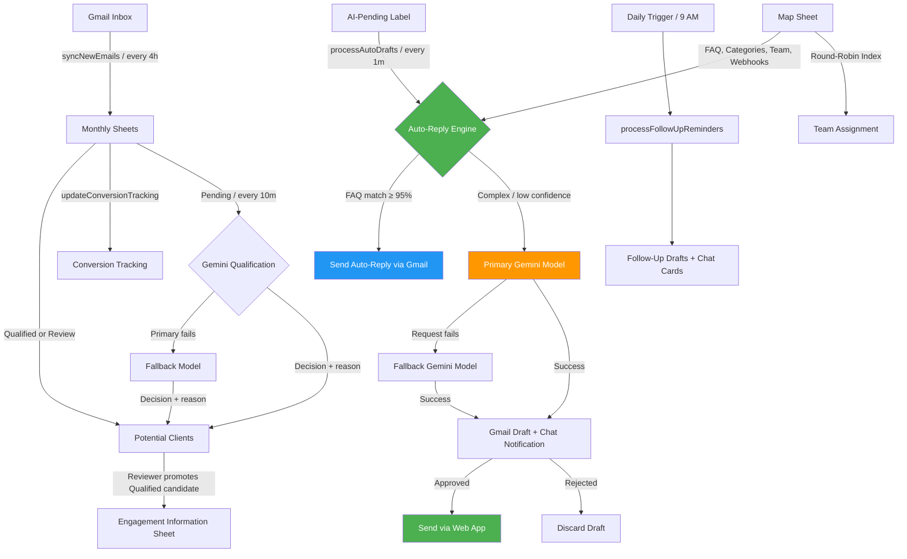

# Mini-CRM — Enhanced CRM Gmail Tracker for Google Sheets

**Version:** 5.7  
**Built for:** [Duran Schulze Law](https://duranschulze.com)  
**Platform:** Google Apps Script (V8 Runtime)  

A lightweight CRM system embedded in Google Sheets that automatically tracks, classifies, and responds to client emails from Gmail, powered by Google Gemini AI.

**Created by:** Atty. MWAD  
**Later revised and enhanced by:** ZACK

---

## Overview

Mini-CRM turns a Google Sheet into a full-featured client relationship management hub. It syncs Gmail inbox emails into structured monthly sheets, classifies them by service category (Visa, Legal, Business Formation, Trademark, Accounting, General), and uses AI to auto-reply or draft responses that go through a human-approval workflow via Google Chat.

### Key Features

| Feature | Description |
|---|---|
| **📬 Correct Inbound Gmail Sync** | Pulls message-level Inbox mail while excluding replies sent by the monitored mailbox or its aliases; Gmail message IDs prevent repeat imports across all monthly sheets |
| **🔐 Mailbox Lock** | Refuses Gmail and automation operations unless the effective Google account is `info@filepino.com` |
| **🎯 AI Lead Qualification** | Uses subject and sanitized body content to score genuine inquiries, explain the decision, and place only qualified/review candidates in a deduplicated review queue |
| **👤 Controlled Promotion** | Reviewers approve, reject, reclassify, and explicitly promote qualified candidates to Engagement without overwriting later CRM work |
| **🤖 AI Auto-Replies** | Uses a user-selected primary Gemini model plus an optional fallback model to generate draft replies and match FAQs with confidence scoring |
| **🛡️ AI Usage Guard** | Master pause switch, pre-AI bulk-mail filtering, central per-minute/daily/workflow limits, six-hour qualification caching, retry backoff, and duplicate-draft checkpoints |
| **✅ Human Approval Workflow** | AI drafts are saved as Gmail drafts and sent as interactive Google Chat cards with **Approve & Send** / **Discard** buttons via a web app |
| **📋 FAQ Auto-Matching** | Automatically answers common questions (e.g., visa requirements, corporation registration) from a configurable FAQ bank in the Map Sheet |
| **🔄 Round-Robin Assignment** | Distributes incoming leads among team members in a rotating fashion |
| **⏰ Follow-Up Reminders** | Daily checks for leads that haven't been engaged and creates Gmail draft reminders + Chat notifications |
| **📊 Conversion Tracking** | Detects client conversions via keyword matching (signed engagement letters, retainer payments, etc.) and logs them to a dedicated sheet |
| **🗂️ Archive System** | Moves prior-year monthly sheets to a year-aware archive and trims old rows to stay within Google Sheets cell limits |
| **📈 Dashboard** | Automatically refreshes an enhanced dashboard with recent-month summaries |
| **🔧 Initial Setup Wizard** | One-click setup that creates all required sheets, headers, dropdowns, formatting, and triggers |

---

## Architecture

---

## Project Structure

| File | Purpose |
|---|---|
| `Code.gs` | Core engine — email sync, parsing, classification, sheet management, dashboard, conversion tracking, setup wizard |
| `Config.gs` | AI configuration — Gemini API settings, FAQ thresholds, follow-up delays, consultation links |
| `AutoReply.gs` | AI-powered email response pipeline — FAQ matching, Gemini draft generation, auto-reply sending |
| `Qualification.gs` | AI sales qualification, structured response validation, Potential Clients queue, reviewer actions, promotion, and funnel metrics |
| `AIRequestGovernor.gs` | Shared Gemini quotas, usage counters, cooldowns, cache helpers, retry scheduling, draft checkpoints, and usage reporting |
| `AIRequestGovernorTests.gs` | Safe regression checks for AI caching and deferred-work behavior without calling Gemini |
| `IngestionTests.gs` | Manual regression checks for Inbox direction, mailbox aliases, authoritative Gmail IDs, and legacy duplicate compatibility |
| `ChatNotifications.gs` | Google Chat integration — sends approval cards with Approve/Reject buttons for AI-generated drafts |
| `FollowUpReminders.gs` | Lead follow-up automation — creates draft reminders and Chat notifications for stale leads |
| `RoundRobin.gs` | Team assignment — cycles through team members stored in the Map Sheet |
| `Triggers.gs` | Time-based trigger management — configures all scheduled jobs |
| `WebApp.gs` | Secure web app endpoint — validates signed Chat links, confirms the action, and performs a single-use Approve/Reject POST |
| `Archive.gs` | Data retention — dynamically archives prior-year sheets and trims old rows to manage cell limits |
| `Backfill.gs` | Historical import — backfills a validated, inclusive custom date range with paginated Gmail searches |
| `Setup.gs` | AI addon setup — FAQ seeding, Gemini API key configuration |
| `GeminiModelSelector.html` | Secure AI routing console for API-token setup, primary/fallback model selection, validation, and connection testing |
| `appscript.json` | AppScript manifest — OAuth scopes, runtime, timezone |

---

## Google Sheets Structure

The system manages several sheets within the spreadsheet:

| Sheet | Purpose |
|---|---|
| **Monthly Sheets** (`Jul-2026`, etc.) | Raw email data: date received, sender, subject, email type, meeting status, summary |
| **Potential Clients** | Deduplicated AI-assisted review queue with confidence, intent, reason, decision source, notes, and promotion traceability |
| **Engagement Information Sheet** | Aggregated lead pipeline with statuses, contact details, and engagement tracking |
| **Conversion Tracking** | Logs client conversions detected from email keywords (signed retainers, payments, etc.) |
| **Map Sheet** | Configuration hub — FAQ entries, category routing emails, team members, Chat webhooks |
| **Dashboard** | Auto-refreshed summary showing recent-month metrics |

### Map Sheet Structure

The Map Sheet is a key-value store with a type column:

| Type | Key | Value |
|---|---|---|
| `FAQ` | Question text | Answer text |
| `CategoryRouting` | Category name (e.g., Visa) | Routing email (e.g., visa@duranschulze.com) |
| `TeamMember` | Member name | Email address |
| `ChatWebhook` | Category | Google Chat webhook URL |

---

## Email Classification

Emails are automatically classified by scanning the content for keywords:

| Classification | Trigger |
|---|---|
| **Meeting Request** | Keywords: `meeting`, `schedule`, `zoom`, `google meet`, `consultation`, etc. |
| **Conversion** | Keywords: `engagement letter signed`, `retainer paid`, `service invoice paid`, etc. |
| **Payment** | Keywords: `payment sent`, `invoice paid`, `paypal`, etc. |
| **Unsubscribe** | Keywords: `unsubscribe`, `opt out`, `stop sending`, `do not contact`, etc. |
| **Trash** | Specific excluded domains/emails and `no-reply` patterns |
| **N/A (Internal)** | Emails from `@duranschulze.com` or `@filepino.com` |

---

## AI Workflow

### Potential-client qualification

1. Gmail sync saves each email to its monthly audit sheet.
2. Hard exclusions for internal, trash, system, and existing-client signals run first.
3. Gemini evaluates the subject and a sanitized, length-limited body and returns a validated JSON decision, confidence, intent, and reason.
4. High-confidence inquiries enter **Potential Clients** as `Qualified`; ambiguous inquiries enter as `Review`; low-confidence non-sales mail stays only in the monthly log.
5. When the immediate AI budget is reached, `processPendingAiQualifications()` continues the queue every 10 minutes.
6. A reviewer can reclassify, approve, reject, or promote a qualified candidate from the **🎯 Potential Clients** menu. Promotion is deduplicated by email and records the Engagement row.

Before qualification, sync verifies that the individual Gmail message is in Inbox and was not sent by the active mailbox or one of its Gmail send-as aliases. It then checks the Gmail message ID against every monthly sheet. The older sender/date/subject key is consulted only for legacy rows without a stored message ID. Mailing-list and automated Gmail headers are rejected deterministically before Gemini is considered.

### AI-assisted replies

1. Apply the **`AI-Pending`** Gmail label to emails needing AI response processing  
2. `processAutoDrafts()` runs every five minutes and processes a bounded set of unread emails in that label  
3. The email body is checked against the **FAQ bank** in the Map Sheet  
   - If a match is found with ≥95% confidence → **auto-reply is sent immediately**  
4. For unmatched/complex emails → **Gemini generates a draft reply**  
   - The draft is saved in Gmail and a **Google Chat card** is sent to the team  
   - The team clicks **Approve & Send** or **Discard**, reviews a confirmation page, then confirms the single-use action  
5. All actions are logged to the Engagement Information Sheet  

---

## Triggers (Automation Schedule)

| Trigger | Function | Frequency |
|---|---|---|
| AI Draft Processing | `processAutoDrafts()` | Every 5 minutes |
| Pending Lead Qualification | `processPendingAiQualifications()` | Every 10 minutes |
| Email Sync | `syncNewEmails()` | Every 4 hours |
| Dashboard Refresh | `buildEnhancedDashboard()` | Daily at 8 AM |
| Follow-Up Reminders | `processFollowUpReminders()` | Daily at 9 AM |
| Sheet Edit Automation | `onEditInstallable()` | When a user edits Engagement or a Potential Clients decision |

---

## Setup & Installation

### Prerequisites
- A Google account with access to Google Sheets, Gmail, and Google Apps Script  
- A [Gemini API key](https://aistudio.google.com/apikey) from Google AI Studio  
- A Google Chat webhook URL (for notifications)  

### Quick Start

1. Sign in as **`info@filepino.com`**. This must be the real Google Workspace mailbox account, not merely a Group or forwarding alias.  
2. Open the Google Sheet and go to **Extensions → Apps Script**  
3. Paste all `.gs` files into the Apps Script editor and update `appscript.json` with the correct OAuth scopes  
4. Use **System Management → Verify Automation Account** and confirm that both addresses shown are `info@filepino.com`.  
5. Choose **Setup / Upgrade Workbook** from the CRM menu (or run `initialSystemSetup()` from Code.gs). Setup safely creates or upgrades the CRM tabs, formatting, labels, and triggers while preserving existing rows and unrelated project triggers.  
6. Select **Configure Gemini Model**, enter your Gemini API token, then choose and test a primary model and optional fallback model.  
7. While still signed in as `info@filepino.com`, deploy the project as a **Web app**, executing as the deploying owner and using the narrowest access setting that includes your reviewers. Redeploy after changing `WebApp.gs`; old unsigned Chat links will no longer work.  
8. Run **`setupAllTriggers()`** as `info@filepino.com` to enable all scheduled automation. Installable triggers always use the account that created them.  
9. If another account previously installed triggers, sign into that account and remove its Mini-CRM triggers from Apps Script. The mailbox lock prevents those triggers from reading Gmail, but one user cannot manage another user's triggers.  
10. Add your team members, FAQ entries, and Chat webhooks to the **Map Sheet**  

---

## OAuth Scopes

The app requires the following Google API permissions:

- `spreadsheets` — Read/write Google Sheets  
- `mail.google.com` / `gmail.modify` / `gmail.send` — Read message-level Inbox state, discover send-as aliases, label, and send emails  
- `userinfo.email` — Identify the active user  
- `script.container.ui` — Show custom menus and dialogs  
- `drive.file` / `drive` — Access Drive folders and archive sheets  
- `documents` — Integration with Google Docs  
- `script.scriptapp` — Manage triggers  
- `script.external_request` — Call Gemini API and Google Chat webhooks  

---

## Customization

- **FAQ Bank**: Add Q&A pairs to the Map Sheet with Type = `FAQ`  
- **Routing Emails**: Add category-to-email mappings with Type = `CategoryRouting`  
- **Team Members**: Add team emails with Type = `TeamMember` for round-robin assignment  
- **Chat Notifications**: Add webhook URLs with Type = `ChatWebhook`  
- **Consultation Links**: Edit `CONSULTATION_LINKS` in `Config.gs`  
- **Follow-Up Delay**: Change `FOLLOW_UP_DELAY_DAYS` in `Config.gs` (default: 3 days)  
- **Gemini Models**: Use **Configure Gemini Model** to select and test a primary model plus an optional fallback. Failed primary requests automatically retry through the fallback; if both fail, the email remains queued for a later retry.  
- **AI Usage Guard**: Open **AI Auto-Reply → Show AI Usage & Limits** to see current consumption and cooldown state, or **Enable / Disable AI Processing** to pause/resume runtime Gemini calls without deleting the API key. Conservative defaults are 4 requests/minute and 150/day, divided into qualification (100), auto-reply (40), and configuration tests (10). Daily counters use Pacific time to match Gemini’s RPD reset. Script Properties with matching `AI_MAX_*` names may override these limits.  

---

## Version History

- **v5.7** — Effective-user mailbox lock for `info@filepino.com`, guarded trigger/setup entry points, automation-account verification menu, and secured follow-up approval links  
- **v5.6** — Signed 24-hour single-use Chat approval links, full-fidelity Gmail draft sending, dynamic year-aware archiving, terminating archive chunk traversal, and parameterized custom-range backfill  
- **v5.5** — Master AI pause switch, pre-AI bulk-mail rejection, central Gemini request governor, bounded trigger batches, per-purpose quotas, qualification-result caching, exponential retry cooldowns, duplicate-draft checkpoints, prompt/output limits, and usage reporting  
- **v5.4** — Message-level inbound-only Gmail collection, active mailbox and alias reply exclusion, workbook-wide Gmail message-ID deduplication, legacy fallback compatibility, and ingestion regression tests  
- **v5.3** — Gemini-assisted potential-client qualification, subject/body analysis, structured decision validation, deduplicated review queue, manual approval/promotion, and Dashboard qualification metrics  
- **v5.2** — Idempotent workbook initialization, canonical tab formatting, filters and status highlighting, full trigger setup, Gmail label creation, Manila timezone, and non-destructive upgrades  
- **v5.1** — Gemini primary/fallback routing, corrected reply detection, canonical Engagement schema, Source Month repair, and corrected Dashboard conversion metrics  
- **v4.9** — AI auto-replies, FAQ matching, Google Chat approvals, follow-up reminders, round-robin, archive system  
- **v4.8** — Corrected email tracking and classification logic  
- Earlier versions — Core Gmail sync and sheet management  

---

## License

Proprietary — Built for Duran Schulze Law. Internal use only.
