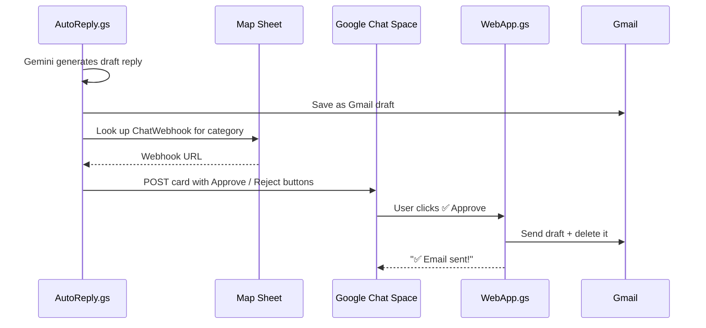

# Google Chat Notifications — Setup Guide

This document covers how to set up Google Chat notifications for AI draft approvals and follow-up reminders in the Mini-CRM.

---

## How It Works



---

## Step 1 — Create a Google Chat Webhook

1. Open **Google Chat** → go to the Space where your team is
2. Click the **Space name** at the top → **Apps & Integrations** → **Add webhooks**
3. Give it a name (e.g., `CRM Notifications`)
4. **Copy the URL** — you'll paste it in Step 2

> 💡 Create **one webhook per category** if you want different spaces for different email types (e.g., Visa drafts go to the Visa team's space, Follow-ups go to the Ops space).

---

## Step 2 — Add Webhooks to the Map Sheet

Open your Google Sheet → go to the **Map Sheet** tab → add rows:

| Type | Key | Value |
|---|---|---|
| `ChatWebhook` | `General` | `https://chat.googleapis.com/v1/spaces/AAAA...` |
| `ChatWebhook` | `FollowUp` | `https://chat.googleapis.com/v1/spaces/BBBB...` |
| `ChatWebhook` | `Visa` | `https://chat.googleapis.com/v1/spaces/CCCC...` |
| `ChatWebhook` | `Legal` | `https://chat.googleapis.com/v1/spaces/DDDD...` |
| `ChatWebhook` | `Business Formation` | `https://chat.googleapis.com/v1/spaces/EEEE...` |
| `ChatWebhook` | `Trademark` | `https://chat.googleapis.com/v1/spaces/FFFF...` |
| `ChatWebhook` | `Accounting` | `https://chat.googleapis.com/v1/spaces/GGGG...` |

> ⚠️ **Not seeded by setup wizard.** You must add these manually. If no `ChatWebhook` row matches a category, the notification is silently skipped.

---

## Step 3 — Deploy the Web App

The Approve / Reject buttons in Google Chat link to a web app URL. Without deployment, the buttons won't work.

1. Open **Apps Script editor** (Extensions → Apps Script)
2. Click **Deploy** → **New deployment**
3. Configure:
   - **Type:** `Web app`
   - **Description:** `CRM Approval Web App`
   - **Execute as:** `Me` (your-email@duranschulze.com)
   - **Who has access:** `Anyone`
4. Click **Deploy** → **Authorize** if prompted
5. **Copy the web app URL** → Click **Done**

> 🔒 Access is set to **Anyone** because Google Chat opens the link as the user who clicks the button — it cannot pass your credentials. The endpoint is minimal (only approves or discards a single Gmail draft by ID) and does not expose spreadsheet data.

---

## What You'll See in Google Chat

### AI Draft Approval Card

```
┌──────────────────────────────────────────────┐
│ 📧 AI Draft Ready for Review                  │
├──────────────────────────────────────────────┤
│ From:     client@example.com                  │
│ Subject:  Re: Visa Inquiry                    │
│                                               │
│ Dear Mr. Santos,                              │
│ Thank you for reaching out to Duran Schulze   │
│ Law regarding your visa inquiry...            │
│                                               │
│     [✅ Approve & Send]    [❌ Discard]       │
└──────────────────────────────────────────────┘
```

### Follow-Up Reminder Card

```
┌──────────────────────────────────────────────┐
│ ⏰ Follow-Up Reminder                         │
├──────────────────────────────────────────────┤
│ Client:   John Doe (john@example.com)         │
│                                               │
│ A follow-up draft is ready.                   │
│ Click to review and send.                     │
│                                               │
│          [✅ Review & Send]                   │
└──────────────────────────────────────────────┘
```

---

## Troubleshooting

| Problem | Likely Cause |
|---|---|
| No card appears in Chat | No `ChatWebhook` row in Map Sheet (or category doesn't match) |
| Buttons open a broken page | Web App not deployed — run **Step 3** |
| "Draft not found" | Draft already approved/rejected by someone else |
| Card shows but wrong space | Wrong webhook URL in the Map Sheet row |
| Notifications stop suddenly | Google Chat webhook was deleted or regenerated — update Map Sheet |

---

## Files Involved

| File | Role |
|---|---|
| `ChatNotifications.gs` | Builds and sends cards to Google Chat webhooks |
| `AutoReply.gs:77` | Calls `sendChatApprovalCard()` after AI draft generated |
| `FollowUpReminders.gs:30` | Calls `sendChatFollowUpCard()` for follow-up reminders |
| `WebApp.gs` | Handles Approve / Reject button clicks from Chat cards |
| `Map Sheet` | Stores `ChatWebhook` URLs by category |
